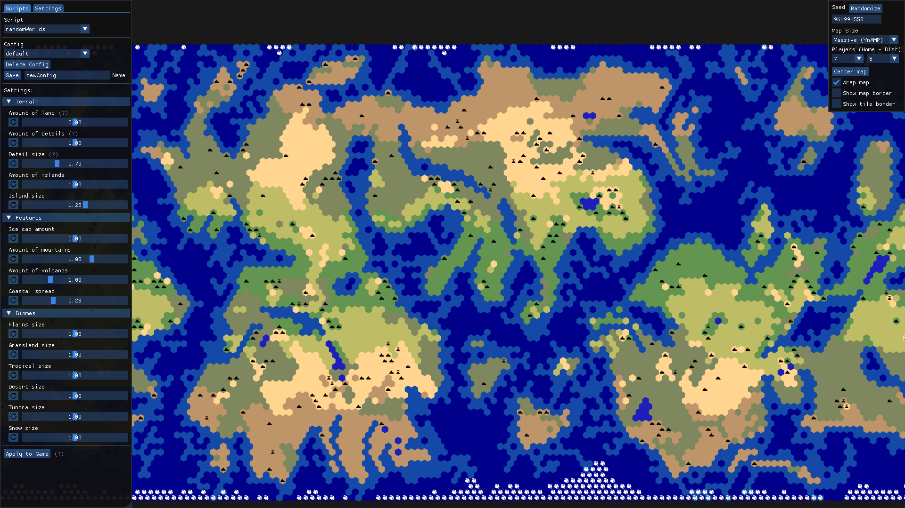

# Map script configurator for Civilization VII

## Features

This tool allows for configuring compatible map scripts. It shows the result in a rendered preview, updating when changes are made.
As an example the amount of land, islands and mountains could be changeable.  
Configs can be created to save wanted configurations. The changes can be applied while the game is running.

## Making a custom script

Guide for [creating a map script](MODDING.md).
